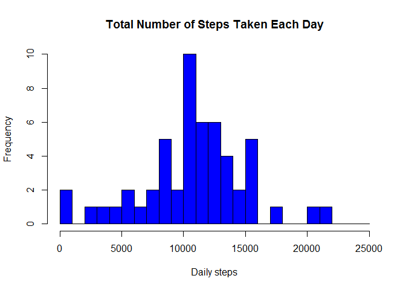

```r
library(dplyr)
```

```
## 
## Attaching package: 'dplyr'
```

```
## The following objects are masked from 'package:stats':
## 
##     filter, lag
```

```
## The following objects are masked from 'package:base':
## 
##     intersect, setdiff, setequal, union
```

```r
library(ggplot2)

knitr::opts_chunk$set(echo = TRUE, fig.path = 'figure/')
```

## Loading and preprocessing the data

Note: The GitHub repository also contains the dataset for the assignment 
so we do not have to download the data separately

1. Load the data (i.e. read.csv())

2. Process/transform the data (if necessary) 
into a format suitable for your analysis


```r
# read data from file in the repo
# unzip the data file 
unzip("activity.zip")
# read the data in a data frame
data <- read.csv( "activity.csv")

# preprocessing 

# total number of steps taken per day for each day in the dataset
dailysteps <- aggregate( steps ~ date, data = data, FUN = sum, na.rm = TRUE)

# average number of steps taken per 5min interval over all days
avgsteps <- aggregate( steps ~ interval, data = data, FUN = mean, na.rm = TRUE)
```

*Answer:*

The data set is loaded in a data frame with
17568 observations of 3 variables
The variables are: steps, date, interval


## What is mean total number of steps taken per day?

For this part of the assignment, you can ignore the missing values in the dataset.

1. Make a histogram of the total number of steps taken each day

2. Calculate and report the mean and median total number of steps taken per day


```r
# histogram

hist(dailysteps$steps,
     breaks = seq(0, 25000, 1000),
     col = "blue",
     main = "Total Number of Steps Taken Each Day", 
     xlab = "Daily steps",
     ylab = "Frequency")
```

<!-- -->

```r
# mean total number of steps taken per day
dailysteps.mean <- mean(dailysteps$steps, na.rm = TRUE)

# median total number of steps taken per day
dailysteps.median <- median(dailysteps$steps, na.rm = TRUE)
```

*Answers:* 

1. The mean number of steps taken per day is
10766.19 

2. The median number of steps taken per day is
10765


## What is the average daily activity pattern?

1. Make a time series plot (i.e. type = "l") of 
the 5-minute interval (x-axis) and the average number of steps taken, 
averaged across all days (y-axis)

2. Which 5-minute interval, on average across all the days in the dataset, 
contains the maximum number of steps?


```r
# x-axis plot labeling preparation 
# we want the tickmarks at the hh:00 positions
xticks.pos <- grep ( "00$", avgsteps$interval, value = TRUE)
# tick lables are hour of the day
xticks.lbl <- seq(1,23,1)

plot( steps~interval, data = avgsteps, 
      type = c("l"), col = "red", 
      main = "Average Daily Activity Pattern",
      xlab = "Time of day (0-24 hour)",
      ylab = "average number of steps", 
      xaxt = "n")
axis( side = 1, at = xticks.pos, labels = xticks.lbl)

# which 5-min interval contains the max number of steps (find the index)
idx <- which.max(avgsteps$steps)

# also plot the line indicating the max activity in the plot line 
abline(v = avgsteps[idx,]$interval, col = "red", lw = 2)
```

<!-- -->

```r
# use gsub to re-format the time interval stamp to hh:mm format. 
maxsteps <- gsub('^([0-9]+)([0-9]{2})$', "\\1:\\2", 
                 avgsteps[idx,]$interval, perl = TRUE)
```


*Answers:* 

The maximum number of steps on average accross all the days in the data set is 
contained in the 5-minute interval at 8:35 


## Imputing missing values

Note that there are a number of days/intervals where there are missing values (coded as NA). The presence of missing days may introduce bias into some calculations or summaries of the data.

1. Calculate and report the total number of missing values in the dataset 
(i.e. the total number of rows with NAs)


2. Devise a strategy for filling in all of the missing values in the dataset. The strategy does not need to be sophisticated. For example, you could use the mean/median for that day, or the mean for that 5-minute interval, etc.

3. Create a new dataset that is equal to the original dataset but with the missing data filled in.

4. Make a histogram of the total number of steps taken each day and Calculate and report the mean and median total number of steps taken per day. Do these values differ from the estimates from the first part of the assignment? What is the impact of imputing missing data on the estimates of the total daily number of steps?


```r
# calculate the number of rows with NAs
missingvals <- sum( is.na(data$steps))

# impute missing values

# first create a dataframe with one additional column containing the value to impute
# steps.o - original steps value
# steps.i - imputed value (to be used in case original value is NA)

# use the average value for the respective interval
nd1 <- merge( data, avgsteps, by = "interval", suffixes = c(".o", ".i"))

# use the original value (.o) if valid else use impute value (.i)
# and create a new "steps" column
nd2 <- mutate( nd1, 
              steps = ifelse( is.na(nd1$steps.o), 
                              nd1$steps.i, nd1$steps.o))

# remove the two utility columns 
newdata <- select(nd2, interval, date, steps)

# calculate the number of rows with NAs
new.missingvals <- sum( is.na(newdata$steps))

# total number of steps taken per day for each day in the dataset
new.dailysteps <- aggregate( steps ~ date, data = newdata, FUN = sum, 
                             na.rm = FALSE) # since we've imputed NAs

# histogram

hist(new.dailysteps$steps,
     breaks = seq(0, 25000, 1000),
     col = "green",
     main = "Total Number of Steps Taken Each Day (imputed missing values)", 
     xlab = "Daily steps",
     ylab = "Frequency")
```

<!-- -->

```r
# mean total number of steps taken per day
new.dailysteps.mean <- mean(new.dailysteps$steps, na.rm = FALSE)

# median total number of steps taken per day
new.dailysteps.median <- median(new.dailysteps$steps, na.rm = FALSE)
```

*Answers:*

1. There are in total 2304 missing values in the dataset*

2. The strategy for filling in the missing values is to use the average value 
for the specific time interval calculated from the data set
(as was calculated in the previous section to investigate the daily activity 
pattern). 
Since there are days without any measurements in the set it's probably better
approach to use this. 

3. The new data set is created - it's a new data frame with 
0 missing values in the dataset

4. The calculated values for the data after imputing missing values are
* The mean number of steps taken per day is
10766.19 
This value is the same as computed without imputing missing values. 
The result is expected, since missing values were ignored. 

* The median number of steps taken per day is
10766.19
This value differs slightly from the value calculated in the first section,
since imputing the mmissing values influences the distribution
Now the median is the same as the mean value. 

## Are there differences in activity patterns between weekdays and weekends?

For this part the weekdays() function may be of some help here. Use the dataset with the filled-in missing values for this part.

1. Create a new factor variable in the dataset with two levels -- "weekday" and "weekend" indicating whether a given date is a weekday or weekend day.

2. Make a panel plot containing a time series plot (i.e. type = "l") of the 5-minute interval (x-axis) and the average number of steps taken, averaged across all weekday days or weekend days (y-axis). 


```r
# create a new column with a factor variable "day", selecting whether the measurement
# is for a weekday or weekend (Sat,Sun)

newdata$day <- as.factor( ifelse( 
        weekdays(as.Date(newdata$date)) %in% c("Saturday", "Sunday"), 
        "weekend", 
        "weekday"))

# panel plot for the time series

# it's interesting to plot the data (not the average) with a trendline
# but this is not in the scope of the assignment
# qplot( interval, steps, data = newdata, geom = c("point", "smooth"), facets = day ~ .)

# calculate the average steps (but keep the day information from the table)
newavgsteps <- aggregate( steps ~ interval + day, data = newdata, FUN = mean)

# plot in a panel (weekdays vs weekend) using a "line" plot
qplot( interval, steps, data = newavgsteps, geom = c("line"), facets = day ~ ., 
       main = "Activity Patterns in Weekdays and Weekends",
       ylab = "number of steps",
       xlab = "interval")
```

<!-- -->

*Answer:*

1. A new column is created with a factor variable named *"day"* indicating "weekday" (Mon-Fri) or "weekend" (Sat, Sun). 

The dataset conains: 

12960 measurements on a weekday and 

4608 measurements on a weekend


2. Looking at the plot of activity patterns in weekdays and weekends we can make
some observations that may possible topics for further thorough investigation:
* In weekdays the activity starts a little earlier and more sharply
* In weekends the activity is more evenly distributed through the day 
* In weekends the activity continues to later hours in the evening
